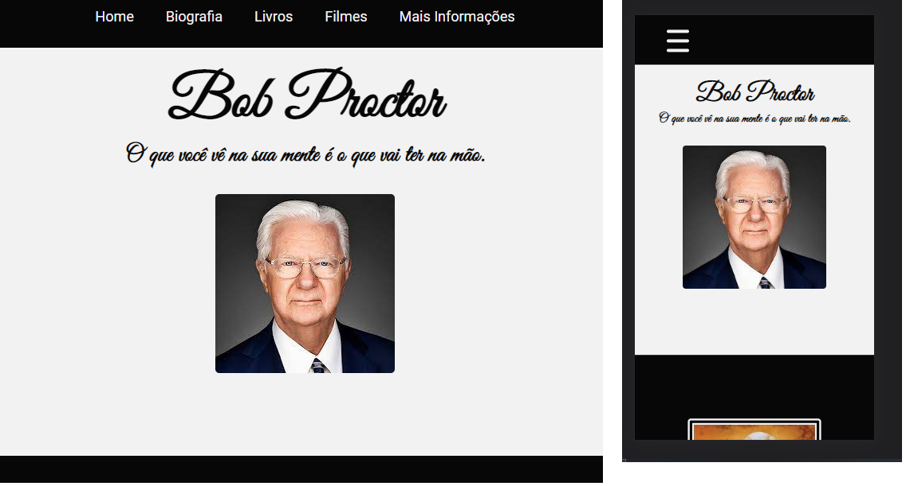
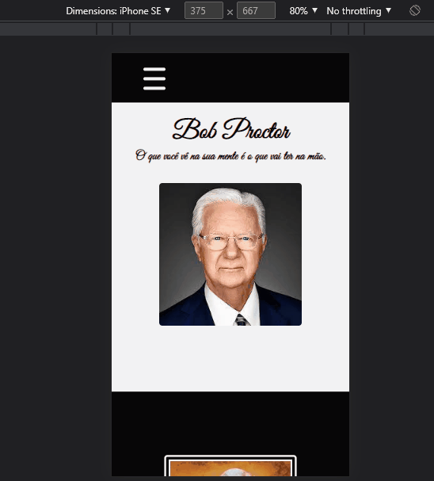

# Bob Proctor

 

## 🎯Objetivo 
Desenvolver uma Página de Tributo a alguém especial .Para treinar os conceitos desenvolvidos no Curso B7Web . 

## 💻 Tecnologias Utilizadas

* HTML
* CSS

## 💻 Bibliotecas Utilizadas 

* Fontawesome
* Google Fonts

 

## Prévia 

 

 

## Como baixar o Projeto 

No local desejado cole o código  abaixo: 

 

~~~
git clone git@github.com:mari-moreira/TBob-Proctor.git

~~~

***
Feito com por <strong>Mariana</strong> com muito ❤️

